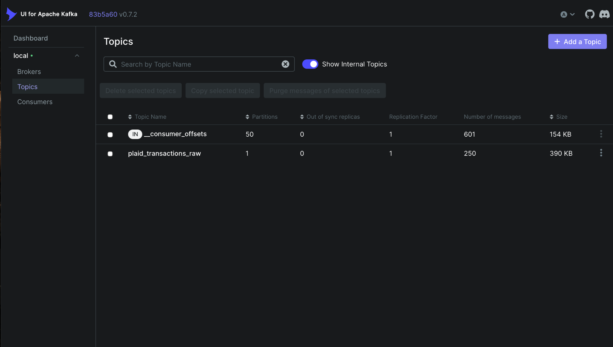
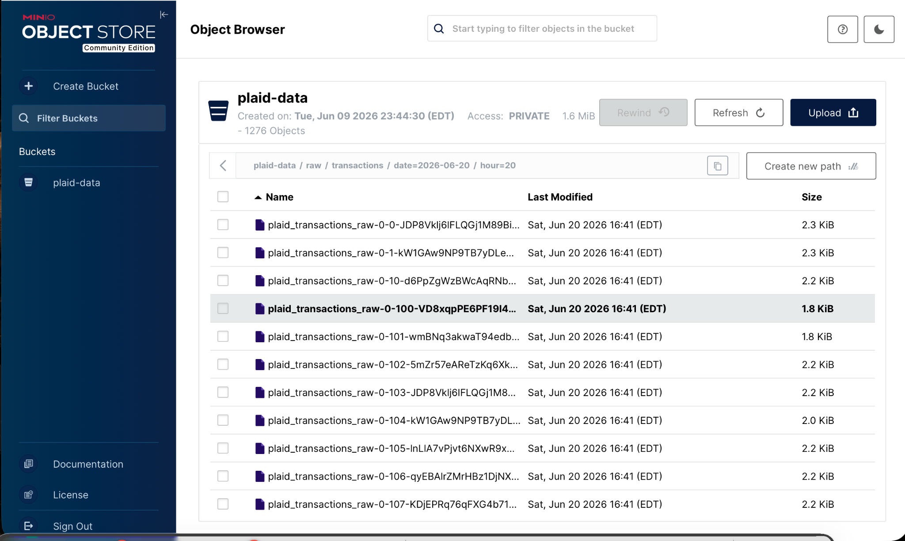
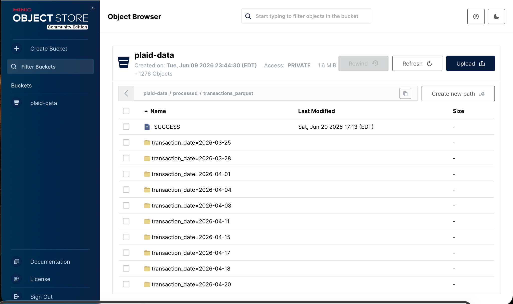
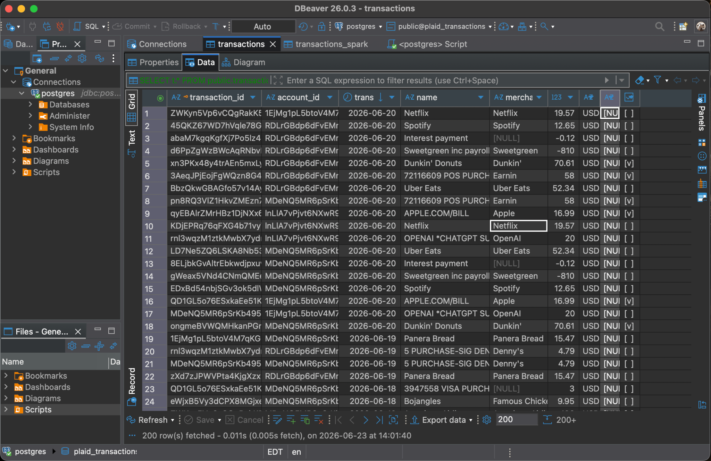
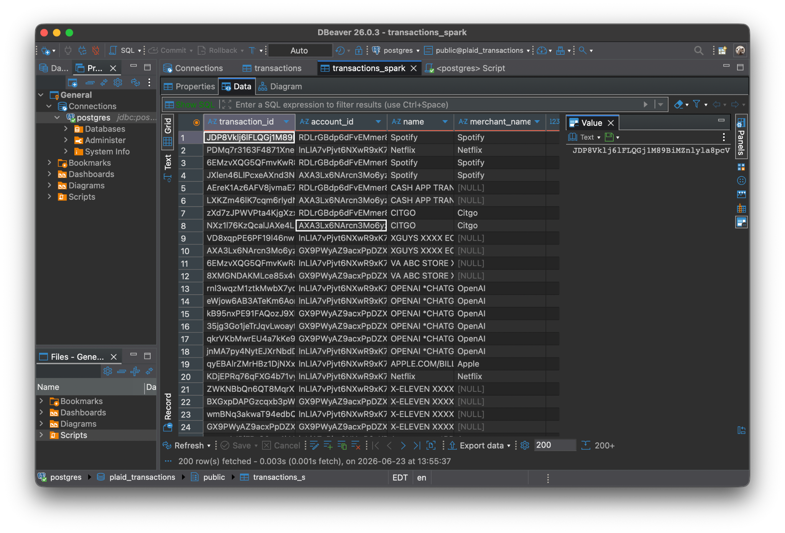
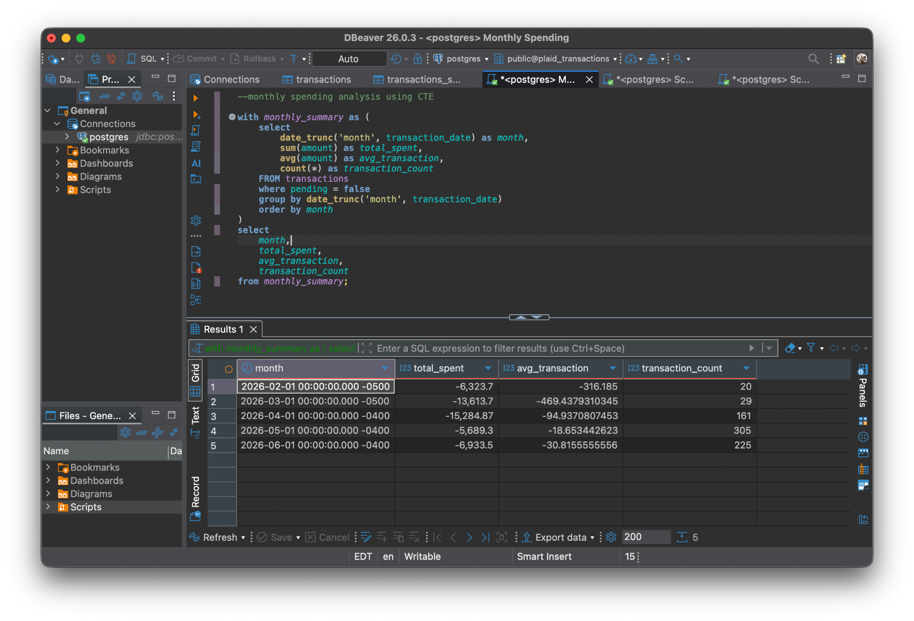
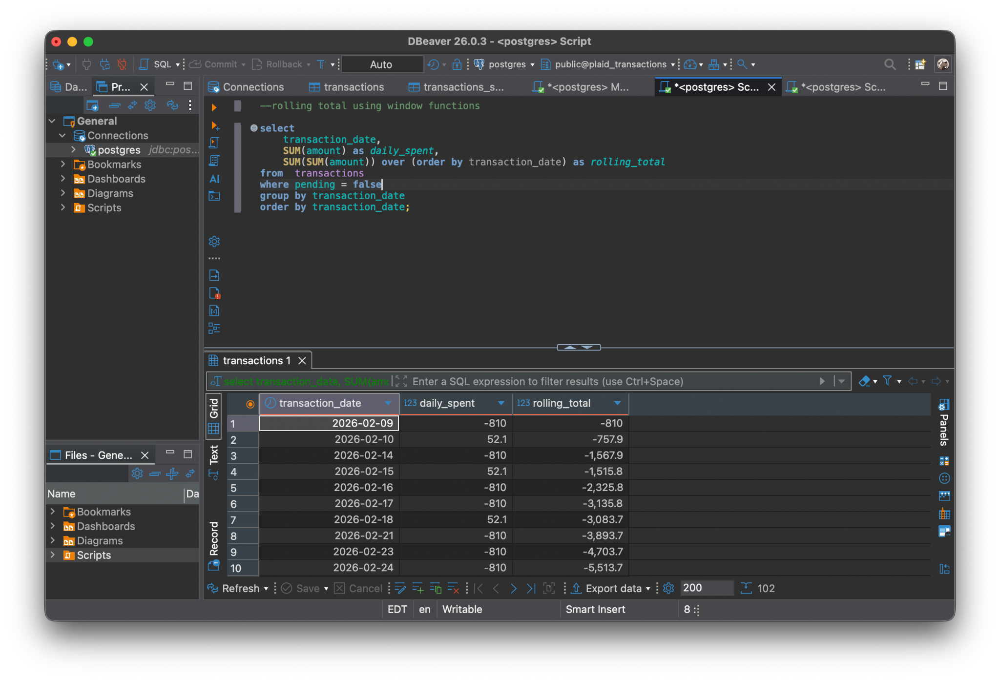

# Real-Time Plaid Transaction Pipeline

I built this project to learn how data moves through a real-time pipeline.
Initially, I had a simple pipeline where data was pulled from Plaid and loaded directly into PostgreSQL. I later expanded it by introducing Kafka, MinIO, and Spark to better understand how production-style data systems are designed.

The pipeline now captures transaction updates from Plaid webhooks, streams them through Kafka, stores raw files in MinIO, processes them using Spark, and finally loads the cleaned data into PostgreSQL for analysis.

## Architecture


### How the Pipeline Works

#### 1. Initial Transaction Sync

`producer_plaid.py`

This script creates a Plaid Sandbox item and performs the initial transaction sync. The transactions retrieved from Plaid are published to Kafka.

#### 2. Receiving Real-Time Updates

`webhook_server.py`

Whenever Plaid detects new or updated transactions, it sends a webhook notification to my Flask server.
The server then calls Plaid's `/transactions/sync` endpoint to fetch only the latest changes and publishes those updates to Kafka.

#### 3. Kafka

I use Kafka as the messaging layer between ingestion and storage.

There are two topics:

- `plaid_transactions_raw` -> stores transaction updates
- `plaid_webhooks` -> stores webhook payloads for debugging

Using Kafka allowed me to separate data ingestion from downstream processing.

#### 4. Storing Raw Data

`consumer_kafka.py`

A Kafka consumer continuously reads transaction messages and stores them as JSON files in MinIO.
Keeping the raw files means I can always reprocess the data if I change my transformation logic later.

Example structure:

```text
raw/
└── transactions/
```

#### 5. Processing Data with Spark

I wanted to learn how Spark works with files stored in object storage, so I added two Spark jobs.

`minio_json_to_parquet.py`

- Reads raw JSON files from MinIO
- Flattens nested transaction fields
- Writes the processed data back as Parquet files

`load_parquet_to_pg.py`

- Reads Parquet files from MinIO
- Loads the transformed records into PostgreSQL

## Tech Stack

- Python
- Plaid Sandbox API
- Flask
- Apache Kafka
- MinIO
- Apache Spark (PySpark)
- PostgreSQL
- Docker

## Screenshots

### Kafka Topics



### MinIO Storage





### PostgreSQL Tables





### Sample SQL Analysis





The SQL screenshots show monthly spending with a CTE and rolling totals using a window function.

## Things I Learned While Building This

- Working with webhook-driven ingestion
- Using Kafka producers and consumers
- Storing raw data in object storage
- Processing semi-structured JSON with Spark
- Converting JSON into Parquet format
- Loading analytical datasets into PostgreSQL
- Writing SQL queries using CTEs and window functions
